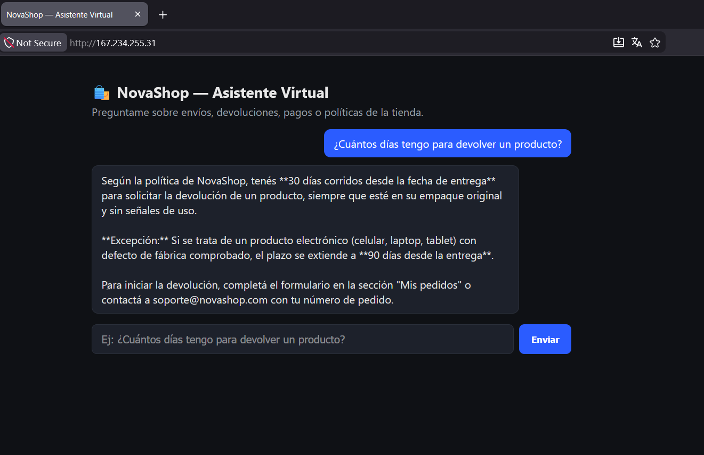

# NovaShop — Agente de IA con RAG desplegado en OCI

Agente conversacional que responde preguntas de soporte al cliente basándose
**exclusivamente** en la documentación oficial de NovaShop (política de
privacidad, devoluciones, FAQ, envíos y términos y condiciones). Construido
con LangChain + Claude (Anthropic) y desplegado públicamente en Oracle Cloud
Infrastructure (OCI).

## Demo en producción (OCI)

> **URL pública:** http://167.234.255.31
>
> **Captura de pantalla:**
>
> 

## 1. Descripción del proyecto

El proyecto tiene tres etapas:

1. **Ingesta del documento** (`docs/documentacion_novashop.pdf`): un PDF con
   las políticas de una tienda online ficticia (NovaShop), generado a partir
   de `docs/fuente_documentacion.md`.
2. **Agente de preguntas y respuestas (RAG)**: el documento se divide en
   fragmentos, se indexan como vectores y, ante cada pregunta, se recuperan
   los fragmentos más relevantes para que Claude genere la respuesta
   basándose solo en ese contexto (evitando alucinaciones).
3. **Despliegue en OCI**: la aplicación se empaqueta en un contenedor Docker
   y se ejecuta en una instancia de OCI Compute, accesible públicamente por
   HTTP.

## 2. Arquitectura

```
┌─────────────┐     1. carga y split      ┌──────────────────────┐
│   PDF        │ ────────────────────────▶ │  RecursiveCharacter  │
│ (NovaShop)   │                           │  TextSplitter        │
└─────────────┘                           └──────────┬───────────┘
                                                       │ chunks
                                                       ▼
                                          ┌────────────────────────┐
                                          │ HuggingFace Embeddings │
                                          │ (all-MiniLM-L6-v2,     │
                                          │  100% local, sin API)  │
                                          └───────────┬────────────┘
                                                       │ vectores
                                                       ▼
                                             ┌───────────────────┐
                                             │  FAISS (índice     │
                                             │  vectorial local)  │
                                             └─────────┬─────────┘
                                                        │
  Usuario ──▶ FastAPI /ask ──▶ retriever.invoke() ─────┘
                     │                 │
                     │        top-k fragmentos relevantes
                     │                 ▼
                     │        ┌──────────────────────┐
                     └───────▶│  Claude (Anthropic)   │──▶ Respuesta
                              │  ChatAnthropic         │    en español
                              └──────────────────────┘
```

**Por qué este diseño:**

- **RAG en vez de fine-tuning**: permite actualizar la base de conocimiento
  (cambiar el PDF) sin reentrenar ni modificar el modelo.
- **Embeddings locales (HuggingFace `all-MiniLM-L6-v2`)**: la búsqueda por
  similitud no depende de ninguna API externa ni consume cuota del LLM;
  solo la generación final de la respuesta usa la API de Claude.
- **FAISS**: índice vectorial simple, sin infraestructura adicional (no
  requiere una base de datos vectorial separada), ideal para un documento
  de este tamaño.
- **Claude (Anthropic) como LLM generador**: recibe únicamente el contexto
  recuperado y la pregunta, con instrucciones explícitas de no responder
  fuera de ese contexto.
- **FastAPI**: expone la lógica como una API HTTP simple (`/ask`) más una
  página estática de chat, fácil de contenerizar y desplegar.

## 3. Stack tecnológico

| Componente        | Tecnología                                   |
|-------------------|-----------------------------------------------|
| Lenguaje          | Python 3.11+                                   |
| Orquestación RAG  | LangChain                                      |
| Lectura de PDF    | PyPDF                                          |
| Embeddings        | sentence-transformers (`all-MiniLM-L6-v2`)     |
| Vectorstore       | FAISS                                          |
| LLM               | Claude (Anthropic API) — `claude-haiku-4-5`    |
| API / Backend     | FastAPI + Uvicorn                              |
| Frontend          | HTML/JS estático (sin build step)              |
| Empaquetado       | Docker                                         |
| Nube              | Oracle Cloud Infrastructure (OCI Compute)      |

## 4. Ejemplos de preguntas y respuestas

El agente responde en base al contenido de
`docs/fuente_documentacion.md`. Algunos ejemplos reales de interacción:

> **Pregunta:** ¿Cuántos días tengo para devolver un producto?
> **Respuesta:** Tenés 30 días corridos desde la fecha de entrega, siempre
> que el producto esté en su empaque original y sin señales de uso. Para
> electrónicos con defecto de fábrica comprobado, el plazo se extiende a 90
> días.

> **Pregunta:** ¿Hacen envíos a Colombia?
> **Respuesta:** Sí. NovaShop realiza envíos a Argentina, Chile, Colombia,
> México y Perú. No se realizan envíos fuera de Latinoamérica.

> **Pregunta:** ¿Qué garantía tienen los cargadores?
> **Respuesta:** Los accesorios, como fundas, cables y cargadores, tienen 6
> meses de garantía.

> **Pregunta:** ¿Puedo cancelar mi pedido si ya fue despachado?
> **Respuesta:** No. Una vez que el pedido cambia a estado "Despachado" ya
> no puede cancelarse, pero podés solicitar una devolución después de
> recibirlo.

> **Pregunta:** ¿Qué pasa si mi pedido llega tarde?
> **Respuesta:** Si no llega dentro del plazo estimado más 5 días
> adicionales, podés solicitar el reembolso completo del costo de envío o
> el reenvío del pedido sin costo adicional.

> **Pregunta:** ¿Puedo pagar en cuotas sin tarjeta de crédito?
> **Respuesta:** No tengo esa información en la documentación disponible.
> Te recomiendo contactar a soporte@novashop.com para confirmarlo.
> *(ejemplo de respuesta cuando la pregunta está fuera del documento — el
> agente no inventa una política que no existe)*

## 5. Estructura del repositorio

```
oracle-one/
├── app/
│   ├── config.py      # configuración (rutas, modelo, variables de entorno)
│   ├── ingest.py       # construye el índice FAISS a partir del PDF
│   ├── agent.py         # cadena RAG (retriever + Claude)
│   └── main.py           # API FastAPI (/ask, /health, frontend estático)
├── docs/
│   ├── fuente_documentacion.md      # contenido fuente editable
│   └── documentacion_novashop.pdf   # documento indexado por el agente
├── scripts/
│   └── generar_pdf.py   # regenera el PDF a partir del .md
├── static/
│   └── index.html        # chat web minimalista
├── deploy/
│   └── cloud-init.sh     # script de arranque automático para OCI Compute
├── Dockerfile
├── requirements.txt
├── .env.example
└── README.md
```

## 6. Cómo ejecutar el proyecto localmente

### Requisitos
- Python 3.11+
- Una API key de Anthropic ([console.anthropic.com](https://console.anthropic.com/settings/keys))

### Pasos

```bash
git clone https://github.com/rodrigo7623/oracle-one.git
cd oracle-one

python -m venv .venv
source .venv/bin/activate        # Windows: .venv\Scripts\activate

pip install -r requirements.txt

cp .env.example .env
# Editar .env y pegar tu ANTHROPIC_API_KEY

# 1) Generar el PDF fuente (ya viene generado en el repo, solo es
#    necesario si modificás docs/fuente_documentacion.md)
python scripts/generar_pdf.py

# 2) Construir el índice vectorial
python -m app.ingest

# 3) Levantar la API
uvicorn app.main:app --host 0.0.0.0 --port 8000
```

Abrir `http://localhost:8000` en el navegador para usar el chat, o probar
directamente la API:

```bash
curl -X POST http://localhost:8000/ask \
  -H "Content-Type: application/json" \
  -d '{"pregunta": "¿Cuántos días tengo para devolver un producto?"}'
```

### Con Docker

```bash
docker build -t novashop-agent .
docker run -p 8000:8000 --env-file .env novashop-agent
```

## 7. Despliegue en OCI (paso a paso)

1. **Crear la instancia de Compute**
   - OCI Console → *Compute* → *Instances* → *Create Instance*.
   - Imagen: **Ubuntu 22.04** (o superior).
   - Shape: `VM.Standard.E2.1.Micro` alcanza para esta demo (elegible para
     el nivel gratuito de OCI).
   - En *Networking*, asignar una **IP pública**.
   - Guardar la clave SSH (o generar una nueva) para poder conectarte.

2. **Abrir el puerto 80 en la Security List / NSG**
   - *Networking* → *Virtual Cloud Networks* → tu VCN → *Security Lists*
     → *Default Security List* → *Add Ingress Rules*.
   - Source CIDR: `0.0.0.0/0`, IP Protocol: `TCP`, Destination Port: `80`.

3. **Conectarte por SSH y desplegar**

   ```bash
   ssh -i tu_clave.pem ubuntu@<IP-PUBLICA>

   sudo apt-get update && sudo apt-get install -y docker.io git
   sudo systemctl enable --now docker

   git clone https://github.com/rodrigo7623/oracle-one.git
   cd oracle-one

   # Crear el .env directamente en la VM (evita exponer la key en scripts)
   echo "ANTHROPIC_API_KEY=sk-ant-tu-clave" | sudo tee .env

   sudo docker build -t novashop-agent .
   sudo docker run -d --restart unless-stopped \
     --name novashop-agent \
     --env-file .env \
     -p 80:8000 \
     novashop-agent
   ```

4. **Verificar**: abrir `http://<IP-PUBLICA>` desde el navegador. Debería
   verse la interfaz de chat de NovaShop respondiendo en vivo.

5. **(Alternativa automatizada)**: `deploy/cloud-init.sh` contiene el mismo
   proceso para pegar como *Initialization script* al crear la instancia,
   de forma que quede desplegada automáticamente al arrancar (recordá
   completar `GITHUB_REPO_URL` y `ANTHROPIC_API_KEY` en el script antes de
   usarlo).

## 8. Limitaciones conocidas

- El agente responde solo con lo que hay en el documento indexado; no
  busca información en internet ni tiene memoria entre preguntas.
- El índice FAISS se reconstruye en cada build de la imagen Docker; si el
  documento cambia hay que reconstruir la imagen (o volver a correr
  `python -m app.ingest`).
- Pensado como demo educativa, no para tráfico de producción real (sin
  HTTPS, autenticación ni rate limiting).
